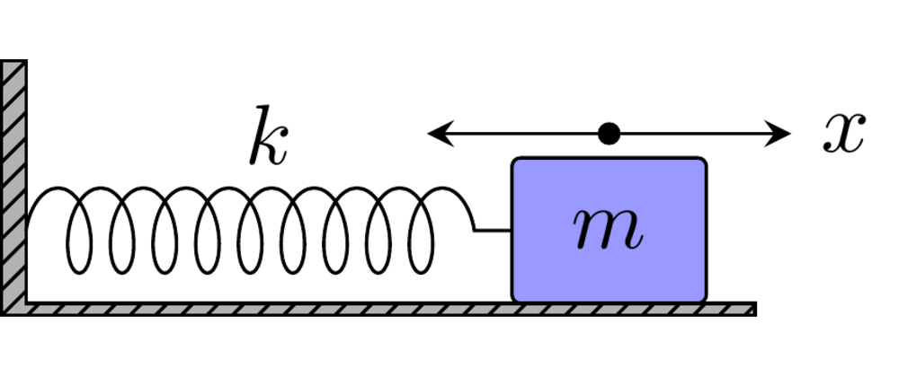

# 1.1 A mass, a spring, and friction

Consider a particle of mass (m) attached to a spring.&#x20;

<figure><figcaption></figcaption></figure>

If the particle is displaced by a distance (x) from its equilibrium position, Hooke's law gives the restoring force&#x20;

$$
F_{\mathrm{spring}}=-kx  \qquad{(1.1.1)}
$$

where (k) is the spring constant.

Using Newton's second law,

$$
F=m\frac{d^2x}{dt^2} \qquad{(1.1.2)}
$$

we obtain

$$
m\frac{d^2x}{dt^2}+kx=0 \qquad{(1.1.3)}
$$

This is the simplest harmonic oscillator.

If there is friction or some other mechanism that removes energy from the oscillator, we can introduce a damping force proportional to the velocity:

$$
F_{\mathrm{damping}}=-\gamma\frac{dx}{dt} \qquad{(1.1.4)}
$$

The equation of motion becomes

$$
\frac{d^2x}{dt^2}+2\beta\frac{dx}{dt}+\omega_0^2x=0 \qquad{(1.1.5)}
$$

It is convenient to define

$$
\omega_0^2=\frac{k}{m} \qquad{(1.1.6a)}
$$

and

$$
2\beta=\frac{\gamma}{m} \qquad{(1.1.6b)}
$$

This equation already contains two different physical processes.

The term $$\omega_0^2x$$ tries to bring the particle back toward equilibrium and therefore produces oscillation. The term $$2\beta\frac{dx}{dt}$$ removes energy and causes the oscillation to decay.

For now, the important point is simply the structure of the equation:

$$
inertia+damping+restoring force=0 \qquad{(1.1.7)}
$$

Keep this equation in mind. We are about to encounter it again in a completely different physical system.
