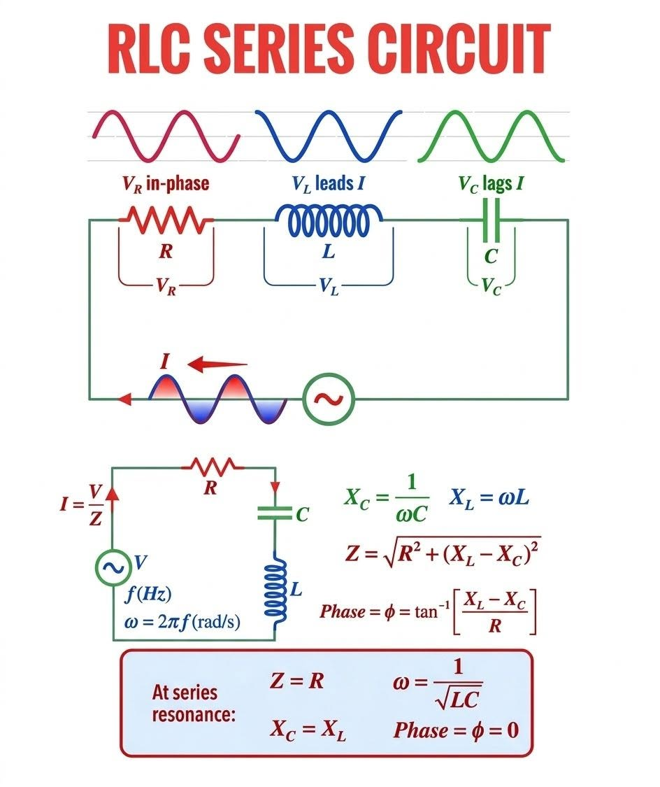

# 1.2 The same oscillator hidden inside an electrical circuit

Consider a series RLC circuit containing a resistor, an inductor, and a capacitor.

<figure><figcaption></figcaption></figure>

The voltage drops across the three components are

$$
V_R=RI \qquad(1.2.1)
$$

$$
V_L=L\frac{dI}{dt} \qquad(1.2.2)
$$

and

$$
V_C=\frac{q}{C} \qquad(1.2.3)
$$

where (q) is the charge stored on the capacitor and

$$
I=\frac{dq}{dt}  \qquad(1.2.4)
$$

is the current. For a closed circuit with no external voltage source, Kirchhoff's voltage law gives

$$
V_L+V_R+V_C=0  \qquad(1.2.5)
$$

Therefore,

$$
L \frac{dI}{dt}+RI+\frac{q}{c}=0   \qquad(1.2.6)
$$

Since&#x20;

$$
I=\frac{dq}{dt}  \qquad(1.2.7)
$$

We can also have&#x20;

$$
\frac{dI}{dt}=\frac{d^2q}{dt^2}  \qquad(1.2.8)
$$

we obtain

$$
L\frac{d^2q}{dt^2}+R\frac{dq}{dt}+\frac{q}{c}=0  \qquad(1.2.9)
$$

The two equations have exactly the same mathematical structure.

| Mechanical oscillator        | RLC circuit     |
| ---------------------------- | --------------- |
| position (x)                 | charge (q)      |
| velocity (dx/dt)             | current (dq/dt) |
| mass (m)                     | inductance (L)  |
| damping coefficient (\gamma) | resistance (R)  |
| spring constant (k)          | (1/C)           |

The physics looks completely different.

One system contains a moving mass and a spring.

The other contains charge, current, resistance, inductance, and capacitance.

But mathematically they are the same dynamical system.

This is our first important lesson:

> **Very different physical systems can become identical once we identify the mathematical structure that governs their evolution.**

The resistor plays the role of friction.

The inductor plays the role of inertia.

The capacitor provides the restoring tendency.

Electrical energy continuously moves between the capacitor and the inductor, just as mechanical energy moves between potential energy in the spring and kinetic energy of the mass.

Resistance gradually removes that energy, just as friction damps a mechanical oscillator.

